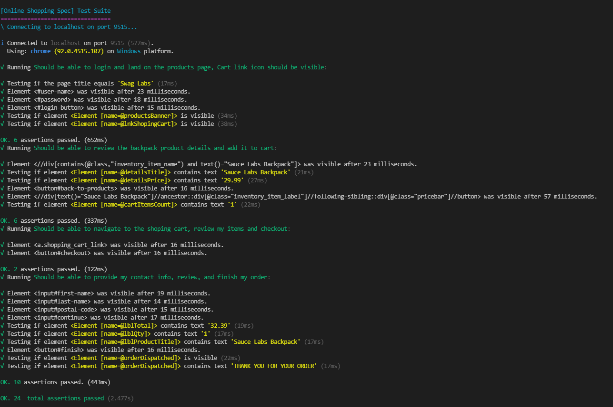

## Saucedemo.com

### Scenario:

- user logs into the saucedemo.com
- clicks on a product to display its details
- checks the price.
- goes back to the products listing page
- adds the product to their shopping cart
- navigates to the shopping cart and then proceeds to checkout, fills out the order form, does a last check on the final price before finishing the order.
- finally checks the "THANK YOU FOR YOUR ORDER" message

### Environment / versions used to develop this test project:

Node JS:
`v12.19.0`

### Dependencies:
    
    `"chromedriver": "^92.0.0",
    "geckodriver": "^2.0.1",
    "nightwatch": "^1.7.7"`

### How to run this project:

- clone the git repo
- cd into the project's root then run `npm init` to install the necessary node packages
- cd into the project's root then run:
  - `npm run chrome` to run the scenario in chrome browser
  - `npm run firefox` to run the scenario in firefox browser

### test reports:

are located in the tests_output folder, nightwatch will create it if deleted.

### Page objects:

this project uses nightwatch's page objects with custom commands

## example console output

### PS:

not necessary really but ... tests run so fast that it is difficult to visually follow along :)

in this example, adding or leaving out pauses doesn't affect the execution nor the assertions

just search replace all the `;//.pause` with `.pause` this will pause for a second or so after each click or fill action ...

